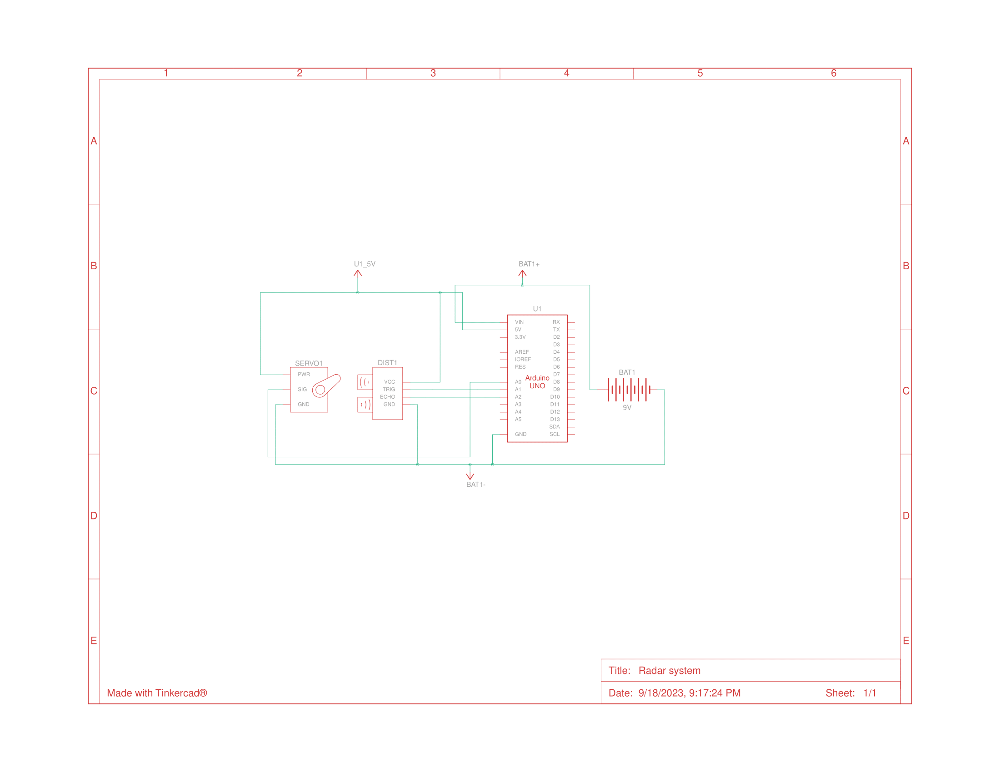
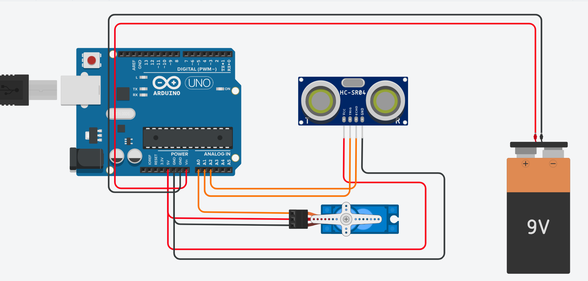

# Radar System Project

## Overview

This Radar System Project is a combination of hardware and software components designed to create a simple radar system using Arduino (C++), Processing (Java), and Django (Python). The project allows you to visualize and track objects within a specified range, making it a great learning experience for anyone interested in radar technology and data visualization.

## Table of Contents

- [Hardware Requirements](#hardware-requirements)
- [Software Requirements](#software-requirements)
- [Installation](#installation)
- [Usage](#usage)
- [Contributing](#contributing)
- [License](#license)

## Hardware Requirements

To build and use this Radar System, you will need the following hardware components:

- Arduino board (e.g., Arduino Uno)
- Ultrasonic distance sensor (e.g., HC-SR04)
- Servo motor
- Breadboard and jumper wires
- A computer to run the software components

## Software Requirements

The Radar System Project relies on the following software components:

1. **Arduino IDE**: To program the Arduino board using C++.

2. **Processing**: To visualize the radar display using Java.

3. **Django**: To create a web interface for accessing radar data using Python.

4. **Python**: Required for Django and other dependencies.

Make sure to install these software components on your computer before proceeding.

## Installation

Follow these steps to set up and run the Radar System Project:

1. **Arduino Setup**:
   - Connect the ultrasonic distance sensor and servo motor to your Arduino board following the wiring diagram provided in the project documentation.
   
   
   - Upload the Arduino code (`radar.ino`) to your Arduino board using the Arduino IDE.

2. **Processing Setup**:
   - Open the Processing sketch (`radar_display.pde`) in the Processing IDE.
   - Make sure to update the COM port in the code to match the one your Arduino is connected to.
   - Run the Processing sketch to display the radar visualization.

3. **Django Setup**:
   - Navigate to the `django_webapp` directory.
   - Install Django and other Python dependencies by running: `pip install -r requirements.txt`.
   - Initialize the Django database: `python manage.py migrate`.
   - Start the Django server: `python manage.py runserver`.

## Usage

1. Power up the Arduino and ensure that it is connected to your computer.

2. Run the Processing sketch to visualize the radar display.

3. Access the radar interface through your web browser to view real-time radar data.

4. Objects within the radar's range will be displayed on the Processing visualization and the web interface.

5. Experiment with different settings and configurations to enhance your radar system.

## Contributing

Contributions to this Radar System Project are welcome! If you have any ideas for improvements or want to report issues, please open an issue or submit a pull request on the project's [GitHub repository](https://github.com/cMardc/radar-system).

## License

This Radar System Project is open-source and is distributed under the [MIT License](LICENSE). Feel free to use, modify, and share it according to the terms of the license.
